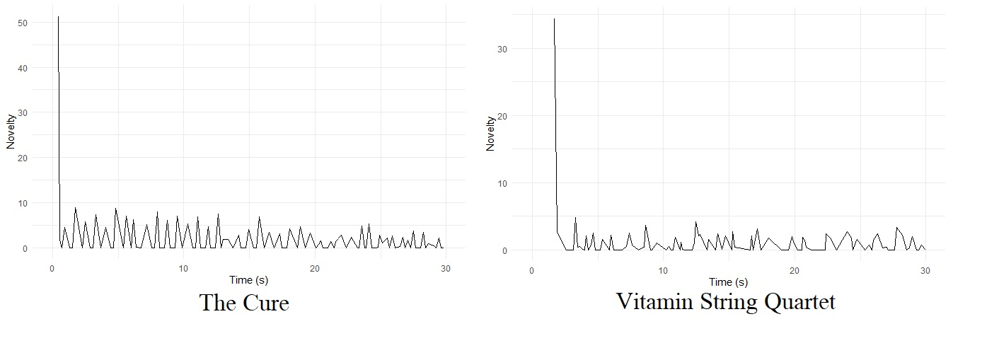

### How do **string quartet covers** differ from the original tracks?

The corpus I will delve into is **Vitamin String Quartet**'s covers of popular songs. As their discography is quite large, I cannot analyze all their music, so I will focus on a random selection of 104 tracks. These tracks have been added to a playlist, while their original versions have been added to a seperate playlist. This way, the two comparisons are only of the tracks and their originals.

I chose this corpus because I love string quartet music. I play violin and cello myself and thus am personally attached to the type of instruments used, but I also think having a group of four instruments makes it possible to hear each instrument individually whilst being able to appreciate how they sound together. The layers of the music can each be distinctly heard. Covering popular music gives a creative twist to the original tracks, while showing people that instruments generally associated with classical music are very versatile and can even motivate people to also go and listen to classical music. 

The most natural comparison points are the original versions of the covered songs. The most obvious differences will likely be _acousticness and instrumentalness_. I imagine _loudness and energy_ could differ as well, but they could be higher in either one. I am curious to see whether fundamental parts of a track like the _key and tempo_ will be altered in the covers. 

In using a specific artist for analyzing string quartet covers, there will likely be more coherency between the covers than if I were to take several string quartets. In this sense, it is not entirely representative of all string quartet covers. While the orginal tracks the covers are based on span across several genres, much of it is popular music and therefore it will largely be a comparison to pop music. In this sense, it is not representative of all genres.

```{=html}

<object
data="https://open.spotify.com/embed/track/4TGw5UkosaYphLYn1T7IWm"
width="280" height="140">
<embed
src:"https://open.spotify.com/embed/track/4TGw5UkosaYphLYn1T7IWm"
width="280" height="140"></embed>
</object>
```


***
```{r, fig.width=3, fig.height=6}
knitr::include_graphics("images/derekstein.jpg")
```


### **Valence, Energy and Loudness** in String Quartet Covers compared to their Original Versions


```{r, fig.dim = c(8,12)}
library(tidyverse)
library(spotifyr)
library(plotly)

vitamincovers <- get_playlist_audio_features("", "08Lc4a3EBvhYdNB6vxIi9X")
originals <- get_playlist_audio_features("", "2t3gPIJo0eRhp1Uspbt5bQ")

stringvsoriginal <-
  bind_rows(
    vitamincovers %>% mutate(category = "Vitamin String Quartet"),
    originals %>% mutate(category = "Original Tracks")
  )

stringsoriginal_plot <- stringvsoriginal %>%
  ggplot(aes(x = valence, y = energy, size = loudness, label = track.name))+
  geom_point(position = 'jitter', color = '#227788', alpha = 0.6)+
  geom_rug(size = 0.15)+
  facet_wrap(~category)+
  theme_light()

ggplotly(stringsoriginal_plot)

p <- ggplotly(stringsoriginal_plot + ylab(" ") + xlab(" "))
x <- list(
title = "Valence")
y <- list(
title = "Energy")
p %>% layout(xaxis = x, yaxis = y, margin = list(l = 75, b =50))
```

***
Comparing **valence, energy and loudness** shows us how having only a string quartet as the performers of the piece changes the mood of a song. The graphs below show us this difference, making it clear that especially the **energy of a song is quite different in a string quartet version**. The size of the points represents the track's loudness, and while there is not a very large difference, it also seems **most string quartet versions are not as loud**. For these graphs, I used a playlist I made of 104 covers by Vitamin String Quartet, and a playlist I made of the original versions of these 104 songs. When hovering over the graphs, you can see the track names and the exact value of valence, energy and loudness per track.

### **Acousticness and Instrumentalness** in string quartet covers vs. their original tracks

```{r, fig.dim = c(8,12)}
library(tidyverse)
library(spotifyr)
library(plotly)

vitamincovers <- get_playlist_audio_features("", "08Lc4a3EBvhYdNB6vxIi9X")
originals <- get_playlist_audio_features("", "2t3gPIJo0eRhp1Uspbt5bQ")

stringvsoriginal <-
  bind_rows(
    vitamincovers %>% mutate(category = "Vitamin String Quartet"),
    originals %>% mutate(category = "Original Tracks")
  )

so_plot <- stringvsoriginal %>%
  ggplot(aes(x = acousticness, y = instrumentalness, label = track.name))+
  geom_point(position = 'jitter', color = 'red', alpha = 0.6)+
  geom_rug(size = 0.15)+
  facet_wrap(~category)+
  theme_light()

ggplotly(so_plot)

p <- ggplotly(so_plot + ylab(" ") + xlab(" "))
x <- list(
title = "Acousticness")
y <- list(
title = "Instrumentalness")
p %>% layout(xaxis = x, yaxis = y, margin = list(l = 75, b =50))
```

***
This is perhaps an unsurprising result, but it is very clear here that **many of the original tracks are at the lowest end of the instrumentalness scale as Spotify provides it, while many of the Vitamin String Quartet versions are at the highest end of the acousticness scale**. This comparison of the two shows us that Spotify does a good job of identifying these features for this corpus.

### **Chromagrams**: Are string quartet versions lower pitched?

```{r}
knitr::include_graphics("images/ChromagramsCM.jpg")
```


*** 

This comparison of the chromagrams of the original and the string quartet rendition of 'Wonderwall' already show that the pitches in both versions are different. As a chromagram captures **harmonic and melodic characteristics**, you would expect a cover track to be similar. I chose this track from my corpus because the duration of the two versions was so close that I thought they would be easily comparable. From these comparisons, however, it seems that the **string quartet version is generally lower pitched than the original**. On the next tab, the two will be combined to show their alignment with the dynamic time-warping technique.

### **Dynamic Time Warping**: The alignment of Oasis's 'Wonderwall' versus its String Quartet cover

```{r}

library(tidyverse)
library(spotifyr)
library(compmus)

wonderwall_orig <- 
  get_tidy_audio_analysis("1qPbGZqppFwLwcBC1JQ6Vr") %>%
  select(segments) %>%
  unnest(segments) %>%
  select(start, duration, pitches)

wonderwall_vit <- 
  get_tidy_audio_analysis("34JU3sMIMPHfW7UM5niPIv") %>%
  select(segments) %>%
  unnest(segments) %>%
  select(start, duration, pitches)

compmus_long_distance(
  wonderwall_orig %>% mutate(pitches = map(pitches, compmus_normalise, "euclidean")),
  wonderwall_vit %>% mutate(pitches = map(pitches, compmus_normalise, "euclidean")),
  feature = pitches,
  method = "cosine"
) %>%
  ggplot(
    aes(
      x = xstart + xduration / 2,
      width = xduration,
      y = ystart + yduration / 2,
      height = yduration,
      fill = d
    )
  ) + 
  geom_tile() +
  coord_equal() +
  labs(x = "Original 'Wonderwall'", y = "Vitamin String Quartet 'Wonderwall'") +
  theme_minimal() +
  scale_fill_viridis_c(guide = NULL)


```

***

With Dynamic Time Warping, we can compare the pitches of the two versions in a single visualisation. If the two tracks have the same pitches, but are performed by two different artist, we can see a diagonal line in this visualisation. In this one, there is no line and it is very difficult to see the similarity of pitches in the two versions of 'Wonderwall'. This leads us to conclude that **while one is copying the melodies of the other, they do not align well**. Despite this being the clearest option of the different normalisation and distance combinations, the chromagram is still quite unclear.

### Now that we have compared string quartet covers to their originals, let's **compare a cover to itself**.

```{r, echo = FALSE, message = FALSE, fig.dim = c(12, 6)}
library(tidyverse)
library(spotifyr)
library(compmus)

dmp <-
  get_tidy_audio_analysis("3g3dvWzQovAuuySinsq99k") %>%
  compmus_align(bars, segments) %>%
  select(bars) %>%
  unnest(bars) %>%
  mutate(
    pitches =
      map(segments,
        compmus_summarise, pitches,
        method = "acentre", norm = "manhattan"
      )
  ) %>%
  mutate(
    timbre =
      map(segments,
        compmus_summarise, timbre,
        method = "mean"
      )
  )
bind_rows(
  dmp %>%
    compmus_self_similarity(pitches, "aitchison") %>%
    mutate(d = d / max(d), type = "Chroma"),
  dmp %>%
    compmus_self_similarity(timbre, "euclidean") %>%
    mutate(d = d / max(d), type = "Timbre")
) %>%
  mutate() %>%
  ggplot(
    aes(
      x = xstart + xduration / 2,
      width = xduration,
      y = ystart + yduration / 2,
      height = yduration,
      fill = d
    )
  ) +
  geom_tile() +
  coord_fixed() +
  facet_wrap(~type) +
  scale_fill_viridis_c(guide = "none") +
  theme_classic() +
  labs(x = "", y = "")

```

***
These self-similarity matrices compare the chroma (pitches) and timbre (character) of Vitamin String Quartet's rendition of the Oingo Boingo classic 'Dead Man's Party'. The **visualisation on the left represents chroma**, showing us **at which points the same pitches appear in the track**. The **one on the right shows us the same thing for timbre**, which is based on several factors like harmonic structure, frequency and intensity. Timbre gives us the "tone color" or "tone quality" of an instrument, which distinguishes it from other instruments.

In these visualisations, we see several diagonal lines. They are most clear in the one comparing **chroma**. These **lines represent paths that define similar segments**. When you listen to the track while looking at the matrix, you can see that the first small diagonal paths are where short melodies repeat, while the longer, very clear ones are a repeat of a longer melody segment. The **bright, perpendicular lines show a sudden new section**. This is also visible in the track, as this is the point where an entirely new melody starts.

In the **timbre** matrix, we cannot see too many clear paths. We do, however, see **bright lines representing novelty, and a checkerboard pattern which shows us homogeneity**. As this is a string quartet cover, the instrumentation is all the same four instruments, and they are all string instruments. This will likely be the cause of the checkerboard pattern. The bright lines could represent the points where the certain instruments either come in, or stop playing.

### Will a **self-similarity matrix** for the original track show the same patterns?

```{r, echo = FALSE, message = FALSE, fig.dim = c(12, 6)}
library(tidyverse)
library(spotifyr)
library(compmus)

dmpo <-
  get_tidy_audio_analysis("2h47SG8bNphmicAll4H9RV") %>%
  compmus_align(bars, segments) %>%
  select(bars) %>%
  unnest(bars) %>%
  mutate(
    pitches =
      map(segments,
        compmus_summarise, pitches,
        method = "acentre", norm = "manhattan"
      )
  ) %>%
  mutate(
    timbre =
      map(segments,
        compmus_summarise, timbre,
        method = "mean"
      )
  )
bind_rows(
  dmpo %>%
    compmus_self_similarity(pitches, "aitchison") %>%
    mutate(d = d / max(d), type = "Chroma"),
  dmpo %>%
    compmus_self_similarity(timbre, "euclidean") %>%
    mutate(d = d / max(d), type = "Timbre")
) %>%
  mutate() %>%
  ggplot(
    aes(
      x = xstart + xduration / 2,
      width = xduration,
      y = ystart + yduration / 2,
      height = yduration,
      fill = d
    )
  ) +
  geom_tile() +
  coord_fixed() +
  facet_wrap(~type) +
  scale_fill_viridis_c(guide = "none") +
  theme_classic() +
  labs(x = "", y = "")

```

***
In these **self-similarity matrices**, we see which sections of the original Oingo Boingo version of Dead Man's Party are similar in terms of chroma and in terms of timbre. As with the Vitamin String Quartet cover, there are several diagonal lines clearly visible in the matrices.

The **chroma matrix** shows diagonal lines at roughly the same amounts of seconds as the string quartet version, this probably means that **where melodies repeat, this is visible in both versions**, as they use the same melodies. In the string quartet version however, there are more diagonal lines close to each other. This could be because the four instruments in the string quartet version repeat after each other more than in the original.

In the **timbre matrix**, we see that it is a lot more clear than the Vitamin String Quartet version. The diagonal lines are clearer, but the checkerboard pattern is less distinct. This is probably due to the instrumentation. The string quartet version, of course, only uses string instruments in the same family. This makes it harder for the timbre matrix to identify different distinctive qualities of certain instrument signs, as these are all in the same family. In this matrix of the original version, **instruments from different families were used to the differences are easier to see**.

### Is the **key** of a piece changed when it is rewritten for a string quartet?

```{r}
library(tidyverse)
library(spotifyr)
library(compmus)
library(plotly)

vitamincovers <- get_playlist_audio_features("", "08Lc4a3EBvhYdNB6vxIi9X")
originals <- get_playlist_audio_features("", "2t3gPIJo0eRhp1Uspbt5bQ")

stringsorig <-
  bind_rows(
    vitamincovers %>% mutate(category = "Vitamin String Quartet"),
    originals %>% mutate(category = "Original Tracks")
  )

key_comp <- stringsorig%>%
  select(playlist_name, key_mode)%>%
  group_by(playlist_name, key_mode)%>%
  mutate(n=n())%>%
  unique()%>%
  group_by(key_mode)%>%
  mutate(total=sum(n))%>%
  mutate(percent=round((n/total)*100))

vizkeys <- ggplot(key_comp, aes(x=key_mode, fill=playlist_name, y = n, 
                                text = paste("Number of Songs: ", n, "<br>",
                                            "Percent Songs in Key: ", percent, "%")))+
  geom_bar(width=0.5, stat = "identity")+
  scale_fill_manual(values = c("blue", "pink"))+
  labs(x="Key", y="Number of Songs") +
  guides(fill=guide_legend(title="Playlist"))+
  theme_minimal()+
  theme(axis.text.x = element_text(angle = 90, vjust = 0.5, hjust=1))+
  ggtitle("Musical Key Makeup of the String Quartet Covers vs. Their Originals")

ggplotly(vizkeys, tooltip=c("text"))
```

***
**Musical key** describes the scale on which a song is based, meaning that most of the notes in a song will come from the scale of that key.In this bar plot, we can see that for the different keys, the number of songs in the playlist of Vitamin String Quartet covers (Vitamin for CompMusic) is not the same as the number of originals (Originals for CompMusic) in that same key. As the Vitamin String Quartet playlist only contains the covers of the songs on the Originals playlist, and no others, this means that the **keys of several songs have to have been changed when transitioning to their string quartet version**.

### How does the **tempo** change when adapting a piece for a string quartet?

```{r, fig.width=100, fig.height=45}
knitr::include_graphics("images/TempogramsLBS.jpg")
```

***
As I was examining my corpus's tempo, I saw that there are no clear outliers, and both the Vitamin String Quartet Covers playlist and the Originals Playlist stayed within roughly the same range. Upon closer look, however, I found that the highest and lowest tempo songs did not match across playlist. For example, the highest tempo song in the string quartet versions was 'Little Black Submarines'. This one was not particularly high ranking in the Originals. This is why I thought it would be interesting to compare tempograms of these two versions.

In the original 'Little Black Submarines' by The Black Keys, you can see that there is a **very obvious sound change at around 130 seconds**. There is a short pause and then a distorted guitar. This is clearly visible in the tempogram, where you can see it is having difficulty determining the tempo there, and it therefore looks like a vague gap in the piece. After this first change, the song goes back to the melody it had before, but with different instrumentation and it sounds like the tempo is slightly higher. **This change is also visible in the tempogram, where you can see the lines shift so that they do not align perfectly with the part before 130 seconds**.

According to Spotify, the tempo of the Vitamin String Quartet version of 'Little Black Submarines' is a little over double the BPM of the original. When listening to both, I can imagine it, as the string quartet version has strings playing in the background that make it sound faster than the very basic instrumentation of this part of the original. **Something that is visible in both tempograms is the change when the song turns to more of a rock song**. The tempogram for Vitamin String Quartet also shows this sudden change at around 130 seconds.

### Are **beat onsets** more easily detected in the original or string quartet versions?

```{r}
library(tidyverse)
library(compmus)
library(spotifyr)


```

***
With an energy-based novelty function, we can try and determine beat onsets based on Spotify's measure of loudness for the track 'Just Like Heaven', orginally by The Cure. As we have seen earlier when comparing valence, energy and loudness, the Vitamin String Quartet versions are generally not as loud as the originals. This is also visible in the visualizations here. It seems that there are **more beats in the original, and the peaks are a bit higher**. When listening to the song, it is indeed easy to hear a fairly high tempo as the percussion makes it very clear. The Vitamin String Quartet cover feels a lot slower, as there is no percussion and they focus more on the melodic structure than keeping the same upbeat feeling.

### Can a **classifier** determine the difference between string quartet covers and their original tracks?

```{r}
library(tidyverse)
library(ggdendro)
library(tidymodels)
library(heatmaply)
library(spotifyr)
library(compmus)

get_conf_mat <- function(fit) {
  outcome <- .get_tune_outcome_names(fit)
  fit %>% 
    collect_predictions() %>% 
    conf_mat(truth = outcome, estimate = .pred_class)
}  

get_pr <- function(fit) {
  fit %>% 
    conf_mat_resampled() %>% 
    group_by(Prediction) %>% mutate(precision = Freq / sum(Freq)) %>% 
    group_by(Truth) %>% mutate(recall = Freq / sum(Freq)) %>% 
    ungroup() %>% filter(Prediction == Truth) %>% 
    select(class = Prediction, precision, recall)
}  

vsqm <- get_playlist_audio_features("spotify", "08Lc4a3EBvhYdNB6vxIi9X")
orim <- get_playlist_audio_features("spotify", "2t3gPIJo0eRhp1Uspbt5bQ")
categor <-
  bind_rows(
    vsqm %>% mutate(playlist = "Vitamin String Quartet") %>% slice_head(n = 20),
    orim %>% mutate(playlist = "Originals") %>% slice_head(n = 20),
  ) 

categor_features <-
  categor %>%  # For your portfolio, change this to the name of your corpus.
  add_audio_analysis() %>% 
  mutate(
    playlist = factor(playlist),
    segments = map2(segments, key, compmus_c_transpose),
    pitches =
      map(
        segments,
        compmus_summarise, pitches,
        method = "mean", norm = "manhattan"
      ),
    timbre =
      map(
        segments,
        compmus_summarise, timbre,
        method = "mean",
      )
  ) %>%
  mutate(pitches = map(pitches, compmus_normalise, "clr")) %>%
  mutate_at(vars(pitches, timbre), map, bind_rows) %>%
  unnest(cols = c(pitches, timbre))

categor_recipe <-
  recipe(
    playlist ~
      danceability +
      energy +
      loudness +
      valence +
      speechiness +
      acousticness +
      instrumentalness +
      liveness +
      tempo +
      duration +
      C + `C#|Db` + D + `D#|Eb` +
      E + `F` + `F#|Gb` + G +
      `G#|Ab` + A + `A#|Bb` + B +
      c01 + c02 + c03 + c04 + c05 + c06 +
      c07 + c08 + c09 + c10 + c11 + c12,
    data = categor_features,          # Use the same name as the previous block.
  ) %>%
  step_center(all_predictors()) %>%
  step_scale(all_predictors())      # Converts to z-scores.
  # step_range(all_predictors())    # Sets range to [0, 1].

categor_cv <- categor_features %>% vfold_cv(5)

knn_model <-
  nearest_neighbor(neighbors = 1) %>%
  set_mode("classification") %>% 
  set_engine("kknn")
categor_knn <- 
  workflow() %>% 
  add_recipe(categor_recipe) %>% 
  add_model(knn_model) %>% 
  fit_resamples(
    categor_cv, 
    control = control_resamples(save_pred = TRUE)
  )

categor_knn %>% get_conf_mat() %>% autoplot(type = "mosaic")

```

***
In this confusion matrix, we look at a classifier's predictions of which song will fit which playlist, compared to which playlist it is actually in. For this matrix, I fed the classifier both my Vitamin String Quartet covers playlist and my playlist of the original versions in question. The Spotify API features used to train the classifier are danceability, energy, valence, loudness, speechiness, acousticness, instrumentalness, liveness, tempo, duration and key. 

I experimented with leaving particular audio features out. For some cases, valence for example, this did lead to more accuracy, but it would not be representative to leave important features out.

**For the Originals playlist, the precision was 0.750, while the recall was 0.9. For the Vitamin String Quartet playlist the precision was 0.875, while the recall was 0.7.** While a human would immediately be able to tell whether or not the song was only played by string instruments, the classifier still did a decent job.

### **Conclusions**: What differences have we seen?

On various levels we have seen that while the string quartet versions are covers, and keep the main melodies of a song, they differ greatly.

For one, the **Vitamin String Quartet versions are much lower energy**. This could be due to the different instrumentation, which Spotify registers as being less energetic. **They are also less loud**, which makes some sense when you think about some of the instruments used in the originals that are not part of a string quartet. 

We've also seen that **despite the fact that the covers mimic the melodies in the original, they can change the pitches significantly**. In 'Wonderwall', for example, it seems like the entire cover version is lower pitched than the original. This also means that you cannot compare the covers to their originals with Dynamic Time Warping, as they simply do not align.

Through self-similarity matrices, we have seen that the **timbre of the string quartet versions makes a huge difference for how we detect different qualities of the piece**. The string quartet's composition is made up of instruments of the same family, so it is hard to determine different timbres, while the orginals use a varying amount of instruments and instrument families.

We've also seen that the **key of a piece has been changed for several songs**. I am not sure why this is, but it is an interesting idea. Most of the string quartet covers are very easy to recognize as the original, despite it being in a different key. 

The **tempo of a song generally translates to the string quartet version fairly evenly**. Even if the overall tempo of a song is not exactly the same, any changes within the original will also be visible changes in the cover. It is, however, more difficult to find beat onsets in the string quartet versions.

Last but not least, **with all these differences, you would think a classifier can easily determine which piece is the cover and which is the original**. A human ear would immediately identify it from the instrumentation (and in most cases, lack of vocals). The classifier does indeed do a pretty good job, but it is not perfect. In this sense, **the human ear is better at identifying what is what than the computer**.

What I have learned from this, is that it is sometimes easy to see that Vitamin String Quartet mimics the originals in a way that makes it very easy for us to recognize it as the original, even if the qualities of the piece are heavily altered. The main conclusion I draw from this is that in this case, humans detect the differences more easily than a computer using the Spotify API. This could be interesting for future improvements to mainly classifiers, and perhaps the Spotify API itself.

***
```{r, fig.width=3, fig.height=6}

```

